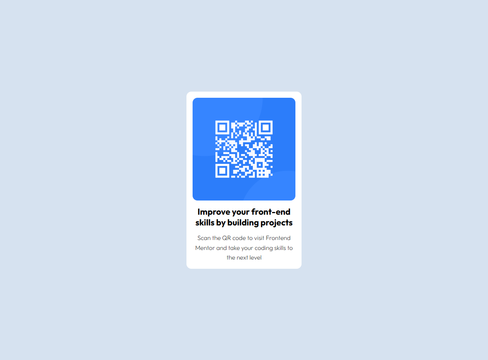

<h1 align="center">QR Code component | Front End Mentor </h1>
<h3 align="center"> Projeto frontend #01 </h3>

  <a  href="#-tecnologias">Tecnologias</a>&nbsp;&nbsp;&nbsp;|&nbsp;&nbsp;&nbsp;
  <a href="#-projeto">Projeto</a>&nbsp;&nbsp;&nbsp;|&nbsp;&nbsp;&nbsp;
  <a href="#-layout">Layout</a>&nbsp;&nbsp;&nbsp;|&nbsp;&nbsp;&nbsp;
  <a href="#memo-licença">Licença</a>

  

 

## 🖌️ Layout

  

## 🚀 Tecnologias

Esse projeto foi desenvolvido com as seguintes tecnologias:

- HTML e CSS.

## 💻 Projeto

Este projeto faz parte do roadmap de projetos do site <a href="https://joseaugustoscherer.github.io/tomjazzscholl/" target="_blank">Frontend Mentor</a>, uma plataforma que tem como objetivo ensinar e aprimorar as habilidades de desenvolvedores frontend por meio de desafios práticos. Os projetos abordam o uso de HTML, CSS, JavaScript e frameworks relacionados, proporcionando aprendizado aplicado e alinhado às demandas do mercado.

## :memo: Licença

Esse projeto está sob a licença MIT.
